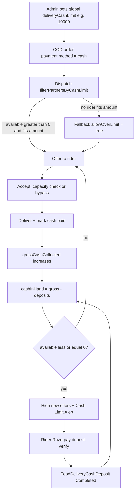

# Delivery Cash Limit — End-to-End Analysis Report

**Date:** 8 July 2026  
**Scope:** Redgo-V2 Food Delivery — cash limit, COD collection, deposit/settlement  
**Case studied:** Limit ₹10,000 vs Cash Collected ₹20,888 (delivery boy: Prince Bangar)

---

## 1. Short verdict (sabse pehle ye padho)

| Question | Answer |
|----------|--------|
| Cash limit kahan set hota hai? | **Admin global setting** — saare delivery boys ke liye ek hi limit |
| Limit full hone pe kya hota hai? | Naye COD offers hide / accept block (soft + hard). Active trip reh sakti hai |
| Delivery boy pay kare toh kya hota hai? | Razorpay deposit → `cashInHand` kam → **available limit automatic wapas badh jati hai** |
| Admin ko limit manually badhani padti hai? | **Nahi** (sirf agar nayi higher global cap chahiye ho) |
| ₹10,000 limit pe ₹20,888 collected kaise? | Admin “Cash Collected” = **lifetime total COD**, limit pehle **unsettled cash (cash in hand)** pe lagti hai — ye dono alag cheezein hain |

**Prince Bangar case (sabse likely):**  
₹20,888 = jitna COD unhone **kabhi bhi collect** kiya (gross lifetime).  
₹10,000 = unke paas **abhi kitna cash rakhne ki max capacity** hai.  
Matlab collected > limit dikhna **normal** hai — bug tab hai jab `cashInHand` khud 10,000 se zyada ho.

---

## 2. Core formula (source of truth)

System mein cash limit **balance field update** se nahi chalti. Har baar orders + deposits se **compute** hoti hai:

```
grossCashCollected = SUM(pricing.total)
                     WHERE orderStatus = 'delivered'
                     AND payment.method = 'cash'
                     AND dispatch.deliveryPartnerId = partner

totalDeposited     = SUM(amount)
                     WHERE FoodDeliveryCashDeposit.status = 'Completed'

cashInHand         = max(0, grossCashCollected − totalDeposited)

availableCashLimit = max(0, deliveryCashLimit − cashInHand)
```

**Example**

| Step | Gross COD | Deposits | Cash in hand | Limit | Available |
|------|-----------|----------|--------------|-------|-----------|
| Start | 0 | 0 | 0 | 10,000 | 10,000 |
| 3 COD delivered (₹4k+₹3k+₹2k) | 9,000 | 0 | 9,000 | 10,000 | 1,000 |
| Rider deposits ₹9,000 | 9,000 | 9,000 | 0 | 10,000 | **10,000** (auto restore) |
| Lifetime COD ₹20,888, deposited ₹15,000 | 20,888 | 15,000 | 5,888 | 10,000 | 4,112 |

Is example mein admin UI pe **Cash Collected = ₹20,888** dikhega (limit se zyada), lekin block **cashInHand 5,888** pe hoga — bilkul sahi behaviour.

---

## 3. Configuration — limit kaise set hoti hai

### Model
- File: `Backend/src/modules/food/admin/models/deliveryCashLimit.model.js`
- Collection: `food_delivery_cash_limits`
- Fields:
  - `deliveryCashLimit` — max COD cash rider rakh sakta hai
  - `deliveryWithdrawalLimit` — pocket withdraw min (COD hold se alag)
  - `maxConcurrentOrders`
  - `isActive`

### Admin APIs
- `GET /food/admin/delivery-cash-limit`
- `PATCH /food/admin/delivery-cash-limit`
- Service: `getDeliveryCashLimitSettings` / `upsertDeliveryCashLimitSettings` in `admin.service.js`

### Important
- **Per-delivery-boy cash limit field nahi hai** partner model pe.
- Saare boys same global `deliveryCashLimit` share karte hain.
- Limit `0` / missing → system treat karta hai **no cap** (`availableCashLimit = MAX_SAFE_INTEGER`) taaki dispatch freeze na ho.

---

## 4. Cash collect kaise hota hai (COD flow)

1. Customer order → `payment.method = 'cash'`
2. Dispatch nearby online partners ko offer karta hai (`filterPartnersByCashLimit`)
3. Rider accept karta hai (capacity / bypass check)
4. Delivery complete → order `delivered`, cash paid mark
5. Us order ka `pricing.total` ab se **grossCashCollected** mein aa jata hai
6. Koi alag `cashCollected++` counter nahi — deliver hi collection event hai

Wallet model (`FoodDeliveryWallet.cashInHand`) exist karta hai, lekin **live cash-limit math is field ko use nahi karti** — har jagah orders − deposits se recalculate hota hai.

---

## 5. Limit full hone pe kya hota hai

### Soft block (browse / offers)
`listOrdersAvailableDelivery` → `getPartnerCashCapacity`:

- `availableCashLimit <= 0` → `cashLimit.blocked = true`
- Message: *“Please deposit your amount to get new orders.”*
- Unassigned naye offers hide; sirf own active trip visible
- Delivery Home pe **Cash Limit Alert** (`DeliveryHomeV2.jsx`)

### Hard block (accept)
`acceptOrderDelivery`:

- Cash order amount > available **aur** `allowOverLimit` bypass nahi → reject
- `hasCapacity = false` aur bypass nahi → reject

### Softeners (limit full hone ke baad bhi kaam chal sakta hai)

1. **Online (non-cash) orders** cash capacity consume nahi karte (`requiredAmount = 0`).
2. **`allowOverLimit` dispatch fallback** (default ON):  
   Agar koi rider order amount fit nahi karta, system phir bhi riders ko offer karta hai jinke paas `available > 0` hai, with `allowOverLimit: true` — accept check bypass.

```
Dispatch fallback (order-dispatch.service.js):
  - Pehle sufficient capacity wale riders
  - Na mile → highest available-limit riders + allowOverLimit: true
```

Isliye limit “full” hone ke bawajood rider kabhi-kabhi COD le sakta hai → **cashInHand limit se upar ja sakta hai**.

---

## 6. Delivery boy “pay” / deposit flow

### Real path (working)
1. Rider app: Pocket → **Deposit Cash**
2. `POST /food/delivery/wallet/deposit/order` — amount ≤ `cashInHand`, Razorpay order
3. Payment
4. `POST /food/delivery/wallet/deposit/verify` — `FoodDeliveryCashDeposit` `status: Completed`
5. Next calc: deposits ↑ → cashInHand ↓ → **availableCashLimit auto ↑**

Files:
- Backend: `deliveryFinance.service.js` (`createDeliveryCashDepositOrder`, `verifyDeliveryCashDepositPayment`)
- Model: `food_delivery_cash_deposits`
- Frontend: `PocketV2.jsx`, deposit popup, settlement history screens

### Deposit ke baad admin ko limit badhani padegi?

| Cheez | Badalti hai? |
|-------|----------------|
| Configured limit (e.g. 10000) | **Nahi** — sirf admin settings se |
| Available capacity | **Haan, automatic** |
| Monday / weekly reset | **Nahi** (UI text galat hai; backend mein weekly reset nahi) |

**Rule:** Admin ko limit tabhi badhani hai jab wo **global cap badhana** chahe. Settlement ke baad capacity khud restore hoti hai.

### Admin / broken paths (context)
- Admin **Collect Cash** UI mock lagti hai — real deposit write nahi karti (verify separately if used in prod).
- Admin wallet edit (`updateDeliveryBoyWallet`) wiring incomplete lagti hai — cash-in-hand manual edit reliable nahi.
- `cash-limit-settlement` admin route register hai, lekin dedicated page file tree mein missing ho sakti hai; deposit list API (`getCashLimitSettlements`) exist karti hai.

---

## 7. Prince Bangar case: Limit 10,000 vs Collected 20,888

### Reason A — Field confusion (most likely ✅)

Admin wallets API (`getDeliveryWallets`):

```js
cashCollected: grossCashCollected,   // LIFETIME COD total
cashInHand,                          // unsettled = gross − deposits
remainingCashLimit: max(0, globalLimit − cashInHand)
```

Admin UI `DeliveryBoyWallet.jsx`:

- Column **Cash Collected** → `cashCollected` (lifetime)
- Column **Cash In Hand** → bug: `collected > 0` pe wapas same `collected` dikhata hai:

```js
const collected = Number(w.cashCollected ?? w.cashInHand ?? 0);
const cashInHand = collected > 0 ? collected : (...);  // ❌ wrongly uses gross as in-hand
```

Isliye table mein **dono columns pe ₹20,888** dikh sakta hai, jabki backend `cashInHand` alag (kam) ho.

**Matlab:** Limit 10k pe collected 20,888 dikhna = “usne life mein itna COD handle kiya”, ye automatically “limit break” nahi hai.

### Reason B — Real over-limit (possible)

Agar asli `cashInHand > 10,000` ho, toh ye reasons:

1. **`allowOverLimit` fallback** — capacity se bada COD accept allow
2. **Accept vs deliver race** — capacity accept pe check; deliver pe pura amount add → beech mein dusre COD se limit fill ho sakti hai, phir bhi ye order deliver hoke overshoot kare
3. **COD detection inconsistency** — `getPartnerCashCapacity` (browse/block) transaction lookup + fallback use karti hai; finance/admin sirf `payment.method === 'cash'` — thoda under/over count possible

### Kaise verify karein (Prince Bangar)

1. Admin → Delivery Boy Wallet → search **Prince Bangar**
2. API compare: `GET /food/admin/delivery/wallets?search=Prince`
   - `cashCollected` (gross)
   - `cashInHand` (unsettled) ← **ye actually matter karta hai**
   - `remainingCashLimit`
3. MongoDB (approx):

```js
// partner
db.food_delivery_partners.find({ name: /Prince Bangar/i }, { name: 1, phone: 1 })

// gross COD
db.food_orders.aggregate([
  { $match: {
      "dispatch.deliveryPartnerId": ObjectId("PARTNER_ID"),
      orderStatus: "delivered",
      "payment.method": "cash"
  }},
  { $group: { _id: null, gross: { $sum: "$pricing.total" }, count: { $sum: 1 } } }
])

// completed deposits
db.food_delivery_cash_deposits.aggregate([
  { $match: { deliveryPartnerId: ObjectId("PARTNER_ID"), status: "Completed" } },
  { $group: { _id: null, deposited: { $sum: "$amount" } } }
])

// global limit
db.food_delivery_cash_limits.find({ isActive: true }).sort({ createdAt: -1 }).limit(1)
```

Expected:

```
cashInHand     = gross − deposited
remaining      = max(0, 10000 − cashInHand)
```

Agar `gross = 20888` aur `deposited ≈ 10888+` → in-hand ≤ 10k → **UI confusion only**.  
Agar `deposited` kam aur `cashInHand > 10000` → **real over-limit** (fallback/race).

Note: “Prince Bangar” signup placeholders mein bhi naam aa sakta hai — live DB pe phone/name se confirm karo.

---

## 8. Glossary (confusion door karne ke liye)

| Term | Matlab |
|------|--------|
| **Limit / totalCashLimit** | Max allowed **cash in hand** (global setting) |
| **Cash collected (gross)** | Lifetime COD sum (`pricing.total`) |
| **Deposited / settled** | Completed `FoodDeliveryCashDeposit` |
| **Cash in hand** | Gross − deposited (abhi unsettled COD) |
| **Available / remaining cash limit** | Limit − cash in hand |
| **Pocket balance** | Earnings + bonus − withdrawals (**COD hold se alag**) |

---

## 9. End-to-end flow diagram



---

## 10. Key files & APIs

### Backend
| Path | Role |
|------|------|
| `Backend/.../admin/models/deliveryCashLimit.model.js` | Global limit schema |
| `Backend/.../admin/services/admin.service.js` | Settings + wallets + settlements |
| `Backend/.../delivery/services/deliveryFinance.service.js` | Wallet, deposit create/verify |
| `Backend/.../orders/services/order-delivery.service.js` | Capacity, offer block, accept check |
| `Backend/.../orders/services/order-dispatch.service.js` | Cash filter + over-limit fallback |
| `Backend/.../delivery/models/foodDeliveryCashDeposit.model.js` | Deposit records |

### Frontend
| Path | Role |
|------|------|
| `Frontend/.../admin/DeliveryCashLimit.jsx` / MultiorderSetting | Set global limit |
| `Frontend/.../admin/DeliveryBoyWallet.jsx` | Admin wallet table (collected/in-hand display issue) |
| `Frontend/.../DeliveryV2/pages/DeliveryHomeV2.jsx` | Cash limit alert |
| `Frontend/.../DeliveryV2/pages/pocket/CashLimitInfoV2.jsx` | Rider limit detail (+ false “Monday reset” copy) |
| Pocket / deposit screens | Deposit cash |

### APIs
| Method | Path |
|--------|------|
| GET/PATCH | `/food/admin/delivery-cash-limit` |
| GET | `/food/admin/delivery/wallets` |
| GET | `/food/admin/delivery/cash-limit-settlements` |
| GET | `/food/delivery/wallet` |
| POST | `/food/delivery/wallet/deposit/order` |
| POST | `/food/delivery/wallet/deposit/verify` |

---

## 11. Bugs / UX issues found

1. **Admin “Cash Collected” vs “Cash In Hand” confusion** — collected = lifetime; UI sometimes both columns pe same number.
2. **`DeliveryBoyWallet.jsx` Cash In Hand mapping bug** — `collected > 0 ? collected : ...` backend `cashInHand` ignore.
3. **`CashLimitInfoV2` copy** — “Resets every Monday and increases with earnings” — **backend mein aisa kuch nahi**.
4. **`allowOverLimit` fallback** — intentional, lekin limit overshoot allow karta hai.
5. **Accept-time vs deliver-time capacity** — race → temporary over-limit possible.
6. **Capacity COD detection mismatch** — transaction-based vs `payment.method` only.

---

## 12. Final answers (Hinglish summary)

1. **Cash limit kaise chalti hai?**  
   Global admin limit − (lifetime COD − completed deposits) = available. Har request pe calculate.

2. **Limit full ho gayi toh?**  
   Naye offers block / accept reject (except over-limit bypass aur non-cash orders). Rider ko deposit karne ko kehte hain.

3. **Delivery boy pay kare toh?**  
   Deposit Completed → cash in hand kam → available limit **automatic** wapas. Admin ko limit number **badhane ki zarurat nahi**.

4. **Admin kab limit badhaye?**  
   Sirf jab company-wide higher cap chahiye (e.g. 10k → 15k). Settlement restore alag cheez hai.ji

5. **Prince Bangar: 10k limit pe 20,888 collected?**  
   Zyadatar: **lifetime COD 20,888**; limit sirf **current unsettled** pe lagti hai. Pehle `cashInHand` aur deposits check karo. Agar in-hand bhi 10k se zyada hai, toh over-limit fallback / race / UI bug mix.

---

## 13. Suggested next fixes (optional)

1. ~~Admin wallet table: **Cash Collected (lifetime)** aur **Cash In Hand (unsettled)** clearly alag + sahi backend fields.~~ **Done**
2. ~~Fix `DeliveryBoyWallet.jsx` line that maps `cashInHand = collected`.~~ **Done**
3. ~~Rider UI se “Resets every Monday…” text hatao / sahi copy.~~ **Done**
4. Product decision: `allowOverLimitFallback` default `false` agar strict enforcement chahiye.
5. (Optional) Deliver-time soft check if cashInHand already > limit.

---

## 14. Why admin did not show “paid” after delivery boy deposited (fixed)

### Root cause
Backend already computed:

```
cashInHand = grossCashCollected − completedDeposits
```

But admin `DeliveryBoyWallet.jsx` **ignored** backend `cashInHand` and did:

```js
cashInHand = collected > 0 ? collected : ...
```

So even after deposit:
- **Cash Collected** stayed lifetime COD (e.g. ₹20,888)
- **Cash In Hand** also showed ₹20,888
- There was **no Cash Deposited / Paid column**
- Sidebar “Cash limit settlement” page file was **missing** (route pointed to deleted/missing module)

Admin pe “paid” dikhne ka koi clear field hi nahi tha.

### Fix applied
1. API ab `cashDeposited` + `totalCashLimit` return karta hai.
2. Admin wallet: **Cash Deposited (paid)** column + Fully/Partially paid badge; Cash In Hand ab sahi unsettled amount.
3. Missing `CashLimitSettlement.jsx` page restore — deposits list with Completed = paid.
4. Settlement API search by name/phone + status filter.

---

*Report generated from codebase analysis of Backend + Frontend cash-limit, wallet, dispatch, and deposit flows.*
